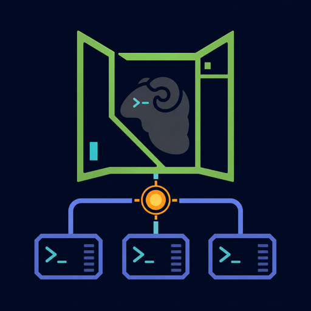

<p align="center">
  
</p>

# signalbox.nvim

`signalbox.nvim` is an attention-first Neovim control surface for persistent coding agents managed by [Herdr](https://herdr.dev/).

It is named after a railway signal box: it does not drive the trains or replace their engines. It gives one operator a compact view of traffic, highlights the routes that need intervention, and provides safe controls at the junctions.

> [!NOTE]
> This is an unofficial community integration. It is not maintained or endorsed by the Herdr project.

## The job

> When I delegate work to several coding agents while editing, help me notice only the work that needs human attention, inspect it without touring terminal panes, intervene, and return after Neovim restarts.

That job shapes the product:

- Herdr owns PTYs, processes, semantic state, and persistence.
- Signalbox owns the Neovim view, transient cache, and editor actions.
- `blocked` and `done` come before terminal topology.
- Recent terminal output is previewed but never persisted by this plugin.
- Attach, prompt, start, and repository actions remain explicit user actions.

## Features

- 90% floating attention board, sized like a full-screen Lazygit workflow
- Current project agents plus `blocked`/`done` agents elsewhere by default
- Ephemeral recent-output preview for the selected agent
- One-key Herdr state explanation with matched detection rule and evidence
- Stable role names for agents discovered outside Signalbox
- Notifications when an agent becomes blocked or completes work
- Herdr 0.7.5 workspace/tab creation and persistent Codex/Claude launches
- Conversation rehoming through the native Claude Code and Codex resume pickers
- Direct attach in a native right-hand Neovim terminal
- Prompt, file, visual selection, range, and LSP diagnostic context
- Optional `Snacks.lazygit` and Diffview actions from the selected agent's cwd
- Compact attention-only status component and `:checkhealth signalbox`, including detection-manifest freshness
- Pure Lua with no required Neovim plugin dependency

## Requirements

- Neovim 0.10+
- Herdr 0.7.5+
- macOS or Linux
- Codex CLI and/or Claude Code

Install Herdr's richer agent integrations once:

```sh
herdr integration install codex
herdr integration install claude
```

## Installation

With lazy.nvim or LazyVim:

```lua
{
  "nwiizo/signalbox.nvim",
  event = "VeryLazy",
  cmd = {
    "Signalbox",
    "SignalboxRefresh",
    "SignalboxStart",
    "SignalboxResume",
    "SignalboxAttach",
    "SignalboxPrompt",
    "SignalboxRename",
    "SignalboxSendVisual",
    "SignalboxSendFile",
    "SignalboxSendDiagnostics",
    "SignalboxHealth",
  },
  keys = {
    { "<C-g>", "<cmd>Signalbox<cr>", mode = { "n", "t" }, desc = "Agent Signalbox" },
  },
  opts = {},
}
```

`<C-g>` is only a recommendation. Signalbox defines no global mappings itself.
`event = "VeryLazy"` starts background monitoring before the board is first opened; commands and keys can still load it earlier. With the default `auto_start_server = true`, it may also start the detached Herdr server on Neovim launch. Omit the event if you want Signalbox and Herdr to start only on demand and do not need ambient notifications.

## Workflow

Open the board with `:Signalbox`.

```text
╭──────── Signalbox  !1  ✓1 ────────╮ ╭──────── reviewer · read-only ────────────╮
│ this project + attention elsewhere │ │ ...                                      │
│                                    │ │ The agent is waiting for approval to     │
│ signalbox.nvim                     │ │ update the public API.                   │
│ ! reviewer       claude  blocked   │ │                                          │
│ * implementation codex   working   │ │                                          │
│ ✓ tests          codex   done      │ │                                          │
╰────────────────────────────────────╯ ╰──────────────────────────────────────────╯
```

Board mappings are buffer-local:

| Key          | Action                                                                                        |
| ------------ | --------------------------------------------------------------------------------------------- |
| `<CR>` / `i` | Leave the read-only preview and attach to the selected agent's interactive terminal           |
| `p` / `s`    | Prompt the selected agent                                                                     |
| `e`          | Toggle recent output / Herdr state-detection explanation                                      |
| `n`          | Give the selected agent a stable role name                                                    |
| `a`          | Accept or edit an unused suggested name, enter the first instruction, start, and attach       |
| `R`          | Resume a saved Claude Code or Codex conversation inside a new Herdr-managed agent              |
| `g`          | Open Snacks Lazygit at the selected agent's repository                                        |
| `d`          | Open Diffview at the selected agent's repository                                              |
| `v`          | Toggle recent-output preview                                                                  |
| `A`          | Toggle default attention view / all agents                                                    |
| `r`          | Refresh immediately                                                                           |
| `q`          | Close                                                                                         |
| `?`          | Toggle help                                                                                   |
| `<Tab>`      | Move between the agent list and read-only preview                                             |

The default view keeps agents from the current Git/Jujutsu root and also surfaces blocked or completed work elsewhere. `A` reveals the whole Herdr session.

The right pane is deliberately a read-only, ephemeral view of recent output. Its title says `read-only`; press `i` or `<CR>` from either pane to replace the board with an interactive Herdr terminal in insert mode.

Use `<C-g>` (`Ctrl-g`) as the single Signalbox key. In a normal editor buffer it opens the board and starts Herdr on demand; in a Signalbox-attached terminal its buffer-local mapping takes priority, detaches the Neovim client, leaves the Herdr agent running, and returns directly to the board. A single control chord has no mapping timeout in which Codex or Claude Code can consume a partial sequence. The terminal key is configurable with `terminal.return_key`.

## Commands

| Command                              | Description                                                                          |
| ------------------------------------ | ------------------------------------------------------------------------------------ |
| `:Signalbox`                         | Toggle the attention board                                                           |
| `:SignalboxRefresh`                  | Refresh Herdr state immediately                                                      |
| `:SignalboxStart [codex\|claude]`    | Accept or edit an unused suggested name, enter the first instruction, start, and attach |
| `:SignalboxResume [codex\|claude]`   | Open the provider's resume picker inside Herdr and attach                            |
| `:SignalboxAttach[!] [target]`       | Attach; `!` explicitly takes over another direct client                              |
| `:SignalboxPrompt [target]`          | Prompt an agent                                                                      |
| `:SignalboxRename [target]`          | Give an agent a stable role name                                                     |
| `:[range]SignalboxPrompt [target]`   | Prompt with complete lines from a range                                              |
| `:'<,'>SignalboxSendVisual [target]` | Prompt with the exact visual selection                                               |
| `:SignalboxSendFile [target]`        | Send the saved current-file reference                                                |
| `:SignalboxSendDiagnostics [target]` | Send current-buffer LSP diagnostics                                                  |
| `:SignalboxHealth`                   | Run `:checkhealth signalbox`                                                         |

Targets accept stable terminal IDs, current pane IDs, or an unambiguous agent name.

## Rehome an existing conversation

Use `R` on the board or `:SignalboxResume codex` / `:SignalboxResume claude` when a conversation that started outside Herdr should become persistent and observable. Exit the original Codex or Claude Code client first. Signalbox never kills it or attempts to move its live process.

After confirmation, Signalbox creates a Herdr-managed pane, opens the provider's native resume picker, and attaches immediately. Select the exact saved conversation there; Signalbox deliberately does not choose the latest session because multiple conversations may share one repository. Current Herdr integrations then report the native session identity so Herdr can restore that conversation after a server restart.

`:checkhealth signalbox` reads Herdr's active detection-manifest status without changing it. A missing check time or one older than seven days is a warning with the explicit `herdr server update-agent-manifests` recovery command; local overrides are reported separately because they intentionally shadow remote rules.

## Ambient status

`statusline()` returns only states that need attention:

```lua
require("signalbox").statusline()
-- "SB !1 ✓1" or "" when there is nothing to handle
```

It can be used from Incline, lualine, or another renderer after Signalbox is loaded. `~` marks last-known data after a refresh failure.

## Notifications

Signalbox observes Herdr's semantic agent state and sends a Neovim notification once when an agent changes to `blocked` or `done`. It does not forward Herdr's own toast. The initial snapshot stays quiet, while `statusline()` and the board still expose existing attention.

Notifications are suppressed while the board is open or the matching live attached terminal is focused because the state is already visible. Closing that surface alone does not replay the event; if the agent leaves the attention state and later returns, the new transition can notify normally. An already delivered notification stays deduplicated for the same Herdr revision. Herdr's `[ui.toast]` delivery is configured independently; enabling both a Herdr desktop/terminal toast and Signalbox notifications intentionally produces two notification surfaces.

## Configuration

```lua
require("signalbox").setup({
  herdr_cmd = "herdr",
  auto_start_server = true,
  agent_start_timeout_ms = 30000,

  agents = {
    codex = { args = {} },
    claude = { args = {} },
  },

  refresh = {
    board_ms = 1000,
    background_ms = 5000,
    timeout_ms = 3000,
  },

  board = {
    width = 0.9,
    height = 0.9,
    preview = true,
    preview_ratio = 0.58,
    preview_lines = 80,
  },

  terminal = {
    side = "right",
    width = 0.4,
    auto_insert = true,
    return_key = "<C-g>",
  },
})
```

Agent `args` are appended after Herdr's canonical agent command without using a shell:

```lua
agents = {
  codex = { args = { "--profile", "work" } },
}
```

## Safety and current limits

- External commands use argv arrays; editor content is never interpolated into a shell command.
- Context larger than the configured line or byte limit is rejected.
- File references reject unnamed and modified buffers.
- Closing Neovim stops only local attach clients, never Herdr agents or its server.
- Resume rehomes saved conversation state, not a running process; stop the original client before selecting its session.
- Signalbox currently refreshes snapshots on a short adaptive poll. Herdr socket events are the next transport milestone.
- Agent-to-Neovim MCP tools and native diff review are deliberately out of scope for v0.1.
- Windows is not supported in v0.1.

## Herdr upgrade monitoring

The repository checks the canonical `herdrdev/herdr` latest stable release daily. If it differs from the currently verified Herdr version, GitHub Actions opens a deduplicated compatibility-audit issue with CLI, schema, and real-agent smoke-test checkpoints. See [the upstream audit runbook](docs/upstream-herdr.md).

See [the design notes](docs/design.md) for the job model and ownership boundary.

## Development

```sh
make check
```

Tests run in a clean headless Neovim and do not require a test framework plugin.

## License

Friend License (MIT-equivalent).
